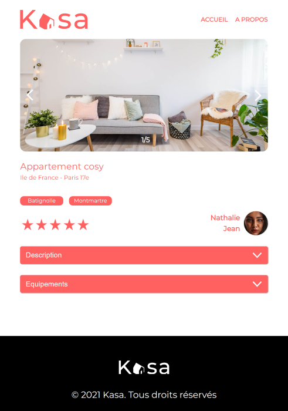
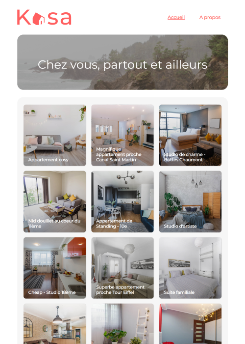

# Projet Kasa: Développez une application Web avec React et React Router

---------------------------------------------------------------------------------------------------------

```diff	
@@ Travail sur la programmation en React et JavaScript @@
```

-------------------------------------------------------------

***<h1 align="center">Travail sur le routage, la gestion des états, les animations, le filtrage</h1>***

<h2 align="center">Projet dans le cadre de la formation développeur d'application JavaScript React</h2> 

Pour voir le résultat du site web mis en ligne, rendez-vous sur [site Les petits plats](https://projet11-palcaroline28-gmailcom.vercel.app/projet11)


***********************************************************************************************************************************************************************

```diff	
@@ Exemple: Image of site @@
```




